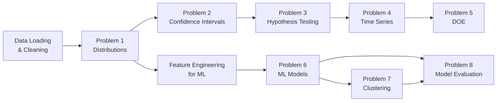

# 🏆 F1 Project Plan — Applied Statistics & Experimental Design

> A comprehensive, multi-part statistical and ML analysis of Formula 1 racing data (1950–2026).
> Each problem is designed to showcase a different course topic while telling an interesting, cohesive story about F1.

---

## Project Overview

| # | Problem Title | Course Topic(s) Covered | Difficulty |
|---|---|---|---|
| 1 | What does a "typical" F1 lap look like? | **Probability distributions**, fitting, goodness-of-fit | ⭐⭐ |
| 2 | How fast is the fastest? Estimating true driver pace | **Confidence intervals & parameter estimation** | ⭐⭐ |
| 3 | Does starting at the front actually matter? | **Hypothesis testing (two-sample)** | ⭐⭐⭐ |
| 4 | The evolution of F1 speed: A 75-year trend | **Time series analysis** | ⭐⭐⭐ |
| 5 | What makes a perfect pit stop? | **First-order orthogonal design** (factorial/response surface) | ⭐⭐⭐⭐ |
| 6 | Predicting race outcomes with ML | **Linear regression, Logistic regression, SVM, KNN, Neural Networks** | ⭐⭐⭐⭐ |
| 7 | Clustering drivers by racing style | **K-means clustering** | ⭐⭐⭐ |
| 8 | Comprehensive model evaluation | **Model selection & evaluation** (hold-out, cross-validation, confusion matrix, etc.) | ⭐⭐⭐⭐ |

> [!TIP]
> Problems 1–5 are **statistics-focused**. Problems 6–8 are **ML-focused**. Problem 8 ties together all ML models from Problem 6–7. This structure naturally builds from exploratory statistics to predictive modeling.

---

## Tools & Libraries

```python
# Core
import pandas as pd
import numpy as np

# Visualization
import matplotlib.pyplot as plt
import seaborn as sns

# Statistics
from scipy import stats            # distributions, tests, CI
import statsmodels.api as sm        # regression, time series (ARIMA)
from statsmodels.tsa.seasonal import seasonal_decompose
from statsmodels.tsa.arima.model import ARIMA

# DOE (Design of Experiments)
from pyDOE2 import ff2n, ccdesign  # factorial designs  (pip install pyDOE2)

# Machine Learning
from sklearn.linear_model import LinearRegression, LogisticRegression
from sklearn.svm import SVC
from sklearn.neighbors import KNeighborsClassifier
from sklearn.neural_network import MLPClassifier
from sklearn.cluster import KMeans
from sklearn.model_selection import (
    train_test_split, StratifiedKFold, RepeatedStratifiedKFold, cross_val_score
)
from sklearn.metrics import (
    confusion_matrix, classification_report, precision_score, recall_score,
    f1_score, accuracy_score, roc_auc_score, roc_curve, silhouette_score
)
from sklearn.preprocessing import StandardScaler, LabelEncoder
from sklearn.pipeline import Pipeline
```

---

## Problem 1: What Does a "Typical" F1 Lap Look Like?

### 📌 Course Topic: **Probability Distributions & Goodness-of-Fit**

### Research Question
> *What probability distribution best describes lap times within a single race? Does this distribution change across circuits or eras?*

### Why This Is Interesting
Each of the 618,766 lap times in the dataset is shaped by car performance, tire degradation, fuel load, traffic, safety cars, and more. Understanding the *shape* of the lap time distribution reveals the hidden physics of racing.

### Data
- **Primary**: `lap_times.csv` (raceId, driverId, lap, position, time, milliseconds)
- **Join with**: `races.csv` (to get year, circuitId), `circuits.csv` (to get circuit name)

### Methodology

#### Step 1: Data Preparation
```python
# Pick a specific race to start (e.g., 2023 Monza — a classic fast circuit)
race_laps = lap_times[lap_times['raceId'] == RACE_ID_MONZA_2023]
times = race_laps['milliseconds'].values

# Remove outliers: first-lap times (cold tires, bunched start) and 
# safety car laps (artificially slow). A good heuristic:
# - Remove lap 1 (formation effects)
# - Remove laps > median + 3*IQR (safety car / pit in-laps)
```

> [!IMPORTANT]
> **What makes this stand out:** Don't just fit one distribution. Show the professor you know *why* certain distributions fit. Lap times have a natural **lower bound** (the car physically can't go faster than its limit) and a **right tail** (slow laps from traffic, safety cars, tire degradation). This suggests a **right-skewed** distribution.

#### Step 2: Fit Multiple Candidate Distributions
```python
candidate_distributions = [
    stats.norm,        # Normal — baseline, likely NOT the best fit
    stats.lognorm,     # Log-Normal — common for positive, right-skewed data
    stats.gamma,       # Gamma — flexible shape for positive data
    stats.weibull_min, # Weibull — common in reliability/engineering
    stats.gumbel_r,    # Gumbel — used for extreme value modeling
]

for dist in candidate_distributions:
    params = dist.fit(times)
    # Store params, compute log-likelihood, AIC, BIC
```

#### Step 3: Goodness-of-Fit Tests
| Test | What it does | Python |
|---|---|---|
| **Kolmogorov-Smirnov** | Compares empirical CDF to theoretical CDF | `stats.kstest(times, dist.name, params)` |
| **Anderson-Darling** | More sensitive in the tails than KS | `stats.anderson(times, dist.name)` |
| **Chi-Square** | Bins the data and compares observed vs. expected | `stats.chisquare(observed, expected)` |
| **AIC / BIC** | Information criteria — penalizes model complexity | Compute manually: `AIC = 2k - 2ln(L)` |

#### Step 4: Visualize
- **Histogram + fitted PDF overlay** for each candidate distribution
- **Q-Q plots** (quantile-quantile) — the better the fit, the closer points lie to the diagonal
- **CDF comparison** — empirical vs. theoretical

#### Step 5: Compare Across Contexts
- Repeat for 3–4 different circuits (street circuit like Monaco vs. high-speed circuit like Monza vs. mixed circuit like Silverstone)
- Repeat for different eras (e.g., 2005 vs. 2015 vs. 2023)
- Does the best-fitting distribution change? **Discuss why:** regulation changes, tire compounds, circuit characteristics

### What Will Impress the Professor
- Show AIC/BIC comparison tables, not just visual fits
- Discuss *why* the winning distribution makes physical sense
- Compare across contexts — this shows depth beyond "I fit one curve"

---

## Problem 2: How Fast Is the Fastest? Estimating True Driver Pace

### 📌 Course Topic: **Confidence Intervals & Parameter Estimation**

### Research Question
> *Can we estimate a driver's "true pace" at a circuit with a confidence interval? How does sample size (number of laps) affect the precision of this estimate?*

### Why This Is Interesting
A driver's fastest lap in a race is **one observation**. But they drive 50–70 laps. Can we use those laps to estimate their "true" underlying pace, and how confident are we in that estimate?

### Data
- **Primary**: `lap_times.csv`
- **Join with**: `drivers.csv`, `races.csv`, `circuits.csv`

### Methodology

#### Step 1: Compute Confidence Intervals for Mean Lap Time
```python
# For a single driver in a single race
driver_laps = lap_times[(lap_times['driverId'] == HAMILTON_ID) & 
                         (lap_times['raceId'] == RACE_ID)]
times = driver_laps['milliseconds'].values

# Point estimate
mean_time = np.mean(times)

# 95% CI using t-distribution (small sample → use t, not z)
ci = stats.t.interval(0.95, df=len(times)-1, 
                       loc=mean_time, scale=stats.sem(times))
```

#### Step 2: Compare CIs Between Drivers
- Compute 95% CI for the top 5 finishers in the same race
- **Visualize as a forest plot** (horizontal error bars for each driver)
- If CIs overlap → "we are not statistically confident one driver was faster"
- If CIs don't overlap → "statistically significant pace difference"

#### Step 3: Effect of Sample Size
- Progressively compute CI using the first 10, 20, 30, 40, 50 laps
- Plot **CI width vs. number of laps** → demonstrate how precision improves with sample size
- Connect this to the formula: CI width ∝ 1/√n

#### Step 4: Bootstrapped Confidence Intervals
```python
# Non-parametric bootstrap CI (doesn't assume normality)
boot_means = [np.mean(np.random.choice(times, size=len(times), replace=True)) 
              for _ in range(10000)]
ci_boot = np.percentile(boot_means, [2.5, 97.5])
```
- Compare **parametric CI (t-based)** vs. **bootstrap CI**
- Discuss: when would they differ? (answer: when the data is skewed — connects to Problem 1!)

#### Step 5: Parameter Estimation — MLE vs. Method of Moments
- Fit a distribution from Problem 1 (e.g., log-normal) using:
  - **Maximum Likelihood Estimation (MLE)**: `stats.lognorm.fit(times)`
  - **Method of Moments (MoM)**: Derive manually from sample mean and variance
- Compare the estimated parameters and discuss efficiency

### What Will Impress the Professor
- The **forest plot** comparing multiple drivers' CIs side by side tells a compelling visual story
- Showing bootstrap vs. parametric CIs demonstrates you understand assumptions behind each method
- The sample size analysis directly illustrates the Central Limit Theorem in action

---

## Problem 3: Does Starting at the Front Actually Matter?

### 📌 Course Topic: **Hypothesis Testing (Two-Sample & Beyond)**

### Research Question
> *Do drivers who qualify in the top 5 ("front of the grid") score significantly more points and finish significantly higher than those who qualify P6–P10 ("midfield")? Has this effect changed across regulation eras?*

### Why This Is Interesting
In F1 lore, "qualifying is everything" — especially at circuits where overtaking is hard (Monaco). But is this statistically true? And does it depend on the era (modern DRS overtaking aids vs. older eras)?

### Data
- **Primary**: `results.csv` — has both `grid` (qualifying position) and `position` / `points` (race outcome)
- **Join with**: `races.csv` (for year/era), `circuits.csv`

### Methodology

#### Step 1: Define Groups
```python
# Group A: Qualified P1–P5 (front runners)
# Group B: Qualified P6–P10 (midfield)
group_front = results[results['grid'].between(1, 5)]
group_mid   = results[results['grid'].between(6, 10)]
```

#### Step 2: Two-Sample t-Test (Points Scored)
```python
# H0: μ_front = μ_mid (no difference in points)
# H1: μ_front > μ_mid (front qualifiers score more)
t_stat, p_value = stats.ttest_ind(group_front['points'], group_mid['points'], 
                                   alternative='greater')
```

#### Step 3: Check Assumptions & Use Alternatives
| Check | Method | If violated, use… |
|---|---|---|
| Normality | Shapiro-Wilk test: `stats.shapiro()` | Mann-Whitney U test (non-parametric) |
| Equal variance | Levene's test: `stats.levene()` | Welch's t-test: `equal_var=False` |

```python
# Mann-Whitney U (non-parametric alternative)
u_stat, p_value = stats.mannwhitneyu(group_front['points'], group_mid['points'],
                                      alternative='greater')

# Effect size — Cohen's d
cohens_d = (mean_front - mean_mid) / pooled_std
```

> [!IMPORTANT]
> **What makes this stand out:** Don't just report a p-value. Report **effect size (Cohen's d)** and **practical significance**. A p-value < 0.05 with n=27,000 is almost guaranteed — the real question is *how big* the effect is.

#### Step 4: Stratified Analysis by Era
```python
# Split into eras with different overtaking characteristics
eras = {
    'Pre-DRS (2005-2010)': results[results['year'].between(2005, 2010)],
    'DRS Era (2011-2021)': results[results['year'].between(2011, 2021)],
    'Ground Effect (2022+)': results[results['year'] >= 2022],
}
# Run the same test within each era
# Has the qualifying advantage decreased with DRS (which helps overtaking)?
```

#### Step 5: Chi-Square Test of Independence
- Create a **contingency table**: Rows = grid group (front / midfield / back), Columns = outcome (podium / points / no points)
- `stats.chi2_contingency(contingency_table)`
- **Cramér's V** for effect size

#### Step 6: Additional Tests to Show Depth
- **Paired test**: For the same driver in the same season — compare their performance at races where they qualified top-5 vs. races where they didn't. This is a **paired t-test** (same subject, different conditions).
- **ANOVA**: Compare mean points across grid groups (P1–P5, P6–P10, P11–P15, P16–P20) → one-way ANOVA with Tukey HSD post-hoc test.

### What Will Impress the Professor
- Checking assumptions before choosing the test (normality, variance)
- Reporting **both** p-value AND effect size (Cohen's d, Cramér's V)
- The era-stratified analysis adds depth — it becomes a story, not just a test
- The paired test shows you thought carefully about confounding variables (driver skill)

---

## Problem 4: The Evolution of F1 Speed — A 75-Year Trend

### 📌 Course Topic: **Time Series Analysis**

### Research Question
> *How have F1 lap times (speed) evolved from 1950 to 2026? Can we decompose this into a long-term trend, seasonal patterns, and the effect of regulation changes? Can we forecast performance?*

### Why This Is Interesting
F1 cars constantly get faster — until the regulations change and they get slower again (e.g., 2014 turbo-hybrid switch, 2022 ground-effect rules). This creates a fascinating "sawtooth" time series with clear structural breaks.

### Data
- **Primary**: Aggregate from `results.csv` — compute **average fastest lap time per season** at a single reference circuit
- **Fix the circuit**: Use a circuit that has been on the calendar for many decades (e.g., **Monza** — raced almost every year since 1950, or **Silverstone**)
- **Join**: `races.csv` (year, circuitId), `circuits.csv`

### Methodology

#### Step 1: Construct the Time Series
```python
# For a specific circuit (e.g., Monza), get the average fastest lap time per year
monza_circuit_id = 14  # look up in circuits.csv
monza_races = races[races['circuitId'] == monza_circuit_id]
monza_results = results[results['raceId'].isin(monza_races['raceId'])]

# Convert fastestLapTime to seconds, then aggregate by year
ts = monza_results.groupby('year')['fastestLapTime_seconds'].mean()
```

#### Step 2: Visualize the Raw Series
- Plot lap time vs. year → you'll see a general downward trend (cars getting faster) with sudden jumps upward (regulation changes making cars slower)
- Annotate the plot with major regulation changes (1994, 2006, 2009, 2014, 2022)

#### Step 3: Decomposition
```python
# Additive decomposition: Y(t) = Trend + Seasonal + Residual
decomposition = seasonal_decompose(ts, model='additive', period=5)
# period=5 because regulation cycles roughly repeat every 4-6 years

decomposition.plot()
```
- **Trend component**: The long-term speed improvement
- **Seasonal/cyclical component**: The regulation-cycle effect (cars get faster within a regulation era, then reset)
- **Residual**: Random variation (weather, specific car innovations)

#### Step 4: Stationarity & Differencing
```python
# Augmented Dickey-Fuller test for stationarity
from statsmodels.tsa.stattools import adfuller
adf_result = adfuller(ts)
# If non-stationary (likely), difference the series: ts_diff = ts.diff().dropna()
```

#### Step 5: ARIMA Modeling
```python
# Fit ARIMA(p, d, q) — use auto_arima or manual ACF/PACF analysis
from statsmodels.graphics.tsaplots import plot_acf, plot_pacf
plot_acf(ts_diff)
plot_pacf(ts_diff)

# Fit model
model = ARIMA(ts, order=(p, d, q))
fitted = model.fit()
print(fitted.summary())
```

#### Step 6: Structural Break Detection
```python
# Chow test or CUSUM test to formally detect regulation change points
# This is advanced but shows deep understanding
from statsmodels.stats.diagnostic import breaks_cusumolsresid
```
- Identify where the time series "breaks" — these should align with known regulation changes
- This adds a **domain knowledge validation** that professors love

#### Step 7: Forecast
- Use the fitted ARIMA model to forecast 3–5 years ahead
- Discuss limitations: regulation changes are **exogenous shocks** that a pure time series model cannot predict
- This shows critical thinking about model assumptions

### What Will Impress the Professor
- Annotating the plot with regulation changes (bridging domain knowledge and data)
- Structural break detection → shows you go beyond basic ARIMA
- Honest discussion of how regulation changes violate time series stationarity assumptions
- Comparing ARIMA forecast vs. actual → the model will fail at regulation changes, and explaining *why* is the analysis

---

## Problem 5: What Makes a Perfect Pit Stop?

### 📌 Course Topic: **First-Order Orthogonal Design (Factorial / DOE)**

### Research Question
> *What factors influence pit stop duration, and can we use a designed experiment framework to analyze their effects and interactions?*

### Why This Is Interesting
Pit stops are the **engineering heartbeat** of F1 — teams of 20+ mechanics changing 4 tires in under 3 seconds. Tiny variations matter enormously. While we can't run a true physical experiment, we can use the **DOE framework** on the observational data to identify factors and interactions.

### Data
- **Primary**: `pit_stops.csv` (raceId, driverId, stop, lap, duration, milliseconds)
- **Join with**: `results.csv` (constructorId), `races.csv` (year, circuitId), `constructors.csv` (team name)

### Methodology

#### Step 1: Define Factors

We treat this as a **2^k factorial design** where we categorize continuous variables into High (+1) and Low (-1) levels:

| Factor | Description | Low (-1) | High (+1) |
|---|---|---|---|
| **A: Team Tier** | Does team budget/prestige matter? | Midfield/backmarker team | Top team (Red Bull, Mercedes, Ferrari) |
| **B: Stop Number** | First stop vs. later stops? | 1st stop | 2nd or later stop |
| **C: Race Phase** | Early race vs. late race? | First half (lap ≤ median) | Second half (lap > median) |
| **D: Era** | Has pit stop tech improved? | Pre-2018 | 2018+ (modern era of sub-2s stops) |

#### Step 2: Construct the Design Matrix
```python
# Encode each pit stop observation into the factorial design
pit_data['A'] = pit_data['constructorId'].apply(lambda x: 1 if x in TOP_TEAMS else -1)
pit_data['B'] = pit_data['stop'].apply(lambda x: -1 if x == 1 else 1)
pit_data['C'] = pit_data.apply(lambda r: -1 if r['lap'] <= median_lap(r['raceId']) else 1, axis=1)
pit_data['D'] = pit_data['year'].apply(lambda y: -1 if y < 2018 else 1)

# Response variable Y = pit stop duration (milliseconds)
```

#### Step 3: Compute Main Effects and Interactions
```python
# For a 2^4 design, compute effects:
# Main effects: A, B, C, D
# Two-way interactions: AB, AC, AD, BC, BD, CD
# Higher-order: ABC, ABD, ACD, BCD, ABCD

import numpy as np

# Effect of factor A:
effect_A = pit_data[pit_data['A'] == 1]['milliseconds'].mean() - \
           pit_data[pit_data['A'] == -1]['milliseconds'].mean()

# Or use OLS regression with the coded variables:
import statsmodels.api as sm
X = pit_data[['A', 'B', 'C', 'D']]  # add interaction terms too
X['AB'] = X['A'] * X['B']
X['AC'] = X['A'] * X['C']
# ... etc
X = sm.add_constant(X)
model = sm.OLS(pit_data['milliseconds'], X).fit()
print(model.summary())
```

#### Step 4: ANOVA on the Factorial Design
```python
# Formal ANOVA to test which factors are significant
from statsmodels.formula.api import ols
from statsmodels.stats.anova import anova_lm

formula = 'milliseconds ~ A * B * C * D'
model = ols(formula, data=pit_data).fit()
anova_table = anova_lm(model, typ=2)
print(anova_table)
```

#### Step 5: Visualize with Interaction Plots
```python
from statsmodels.graphics.factorplots import interaction_plot
interaction_plot(pit_data['A'], pit_data['B'], pit_data['milliseconds'])
```
- **Main effects plot**: Bar chart showing magnitude of each factor's effect
- **Interaction plot**: Lines crossing = significant interaction (e.g., top teams might show *bigger* improvement in later eras → Team × Era interaction)
- **Pareto chart of effects**: Rank all effects by magnitude

#### Step 6: Response Surface (Optional — for extra credit)
If you want to go further, treat stop lap and year as continuous and fit a **response surface model**:
```python
# Y = β0 + β1*lap + β2*year + β11*lap² + β22*year² + β12*lap*year + ε
```
This creates a 3D surface plot showing how duration varies across lap and year simultaneously.

### What Will Impress the Professor
- Explicitly constructing the **design matrix** with coded variables (+1/−1) — this directly mirrors lecture material
- The ANOVA table with F-statistics and p-values for each effect and interaction
- **Interaction plots** — these are the signature deliverable of DOE analysis
- Connecting back to domain knowledge: "Top teams have more engineers and practice → faster stops"

---

## Problem 6: Predicting Race Outcomes with ML

### 📌 Course Topic: **ML Models — Linear Regression, Logistic Regression, SVM, KNN, Neural Networks**

### Research Question
> *Given pre-race information (qualifying position, historical driver performance, constructor strength, circuit type), can we predict: (a) the number of points a driver will score (regression), and (b) whether a driver will finish on the podium (classification)?*

### Why This Is Interesting
This is the dream question for any F1 fan: **can we predict who will win?** We use only information known *before* the race starts, making this a genuine prediction problem.

### Data — Feature Engineering Is Key

Build one master DataFrame: **one row per driver per race**.

```python
# Merge: results + races + drivers + constructors + qualifying + circuits
df = results.merge(races[['raceId','year','round','circuitId']], on='raceId')
df = df.merge(drivers[['driverId','dob','nationality']], on='driverId')
df = df.merge(constructors[['constructorId','name']], on='constructorId', suffixes=('','_team'))
df = df.merge(qualifying[['raceId','driverId','position']], on=['raceId','driverId'], 
              suffixes=('','_quali'))
df = df.merge(circuits[['circuitId','circuitRef','country','alt']], on='circuitId')
```

#### Engineered Features (this is where you shine):

| Feature | Description | How to compute |
|---|---|---|
| `grid` | Qualifying/starting position | Directly from `results.csv` |
| `driver_avg_points_last5` | Driver's average points in last 5 races | Rolling window on `results.csv` sorted by date |
| `constructor_season_points` | Constructor's cumulative points this season so far | From `constructor_standings.csv` |
| `driver_circuit_history` | Average finish position at this specific circuit in past years | Historical filter on `results.csv` |
| `driver_age` | Age of the driver at race time | `race_date - dob` |
| `dnf_rate_last10` | DNF rate in last 10 races | % of last 10 races with `statusId != 1` |
| `circuit_type` | Street / permanent / high-speed | Manual label or cluster from `circuits.csv` (alt, lat, lng) |
| `home_race` | Is the driver racing in their home country? | `driver.nationality == circuit.country` |

> [!IMPORTANT]
> **Critical rule**: Never use information from the race itself (lap times, pit stops, race position) as features — that would be **data leakage**. Only use information available *before* the race starts.

### Part A: Regression — Predicting Points Scored

#### Target: `points` (continuous: 0–26)

```python
# Models to compare:
models_reg = {
    'Linear Regression': LinearRegression(),
    'Ridge Regression': Ridge(alpha=1.0),  # regularized
}

# Evaluation metrics:
# - RMSE (Root Mean Squared Error)
# - MAE (Mean Absolute Error)  
# - R² (Coefficient of Determination)
```

- Fit a linear regression. **Interpret the coefficients**: "For each 1-position improvement in qualifying, a driver scores β₁ more points, holding all else equal."
- Check **regression diagnostics**: residual plots, normality of residuals, multicollinearity (VIF)
- This section connects back to **confidence intervals** (Problem 2) — put CIs on the regression coefficients

### Part B: Classification — Predicting Podium Finish

#### Target: `podium` (binary: 1 if position ≤ 3, else 0)

```python
# Models to compare:
models_clf = {
    'Logistic Regression': LogisticRegression(max_iter=1000),
    'SVM (RBF kernel)': SVC(kernel='rbf', probability=True),
    'SVM (Linear kernel)': SVC(kernel='linear', probability=True),
    'KNN (k=5)': KNeighborsClassifier(n_neighbors=5),
    'KNN (k=11)': KNeighborsClassifier(n_neighbors=11),
    'Neural Network': MLPClassifier(hidden_layer_sizes=(64, 32), max_iter=500),
}
```

For each model, train and evaluate (see Problem 8 for the full evaluation framework).

#### KNN-Specific Analysis
```python
# Find optimal k using cross-validation
k_range = range(1, 31)
cv_scores = []
for k in k_range:
    knn = KNeighborsClassifier(n_neighbors=k)
    scores = cross_val_score(knn, X_train, y_train, cv=5, scoring='f1')
    cv_scores.append(scores.mean())
    
# Plot k vs. CV F1 score → find the "elbow"
plt.plot(k_range, cv_scores)
plt.xlabel('k')
plt.ylabel('Cross-Validated F1 Score')
```

#### Neural Network-Specific Analysis
```python
# Try different architectures:
architectures = [(32,), (64, 32), (128, 64, 32)]
# Compare training curves (loss vs. epoch) to detect overfitting
```

### What Will Impress the Professor
- **Feature engineering** — the thoughtfulness of features shows domain understanding
- Explicitly avoiding data leakage and explaining *why*
- **Interpreting** model coefficients (especially logistic regression odds ratios and linear regression betas)
- Comparing multiple models systematically (see Problem 8)

---

## Problem 7: Clustering Drivers by Racing Style

### 📌 Course Topic: **K-Means Clustering (Unsupervised Learning)**

### Research Question
> *Can we identify distinct "types" of F1 drivers based on their racing statistics? Do natural clusters emerge that correspond to intuitive archetypes (e.g., "qualifier specialist", "consistent scorer", "aggressive racer")?*

### Why This Is Interesting
Instead of predicting outcomes, we're *discovering structure* in the data. This is unsupervised learning — we don't tell the algorithm what the groups are.

### Data
Create a **driver-level summary** DataFrame (one row per driver, aggregated across their career or a specific era).

```python
# Aggregate driver statistics
driver_stats = results.groupby('driverId').agg(
    total_races=('resultId', 'count'),
    avg_grid=('grid', 'mean'),
    avg_finish=('positionOrder', 'mean'),
    avg_points=('points', 'mean'),
    total_wins=('position', lambda x: (x == '1').sum()),
    win_rate=('position', lambda x: (x == '1').mean()),
    podium_rate=('position', lambda x: (x.astype(float) <= 3).mean()),
    dnf_rate=('statusId', lambda x: (x != 1).mean()),
    avg_positions_gained=('grid', lambda x: ...) # grid - finish position
    grid_variance=('grid', 'std'),  # consistency in qualifying
)

# Filter: only drivers with >= 20 races (enough data for meaningful statistics)
driver_stats = driver_stats[driver_stats['total_races'] >= 20]
```

### Methodology

#### Step 1: Feature Selection & Scaling
```python
features = ['avg_grid', 'avg_finish', 'avg_points', 'win_rate', 
            'podium_rate', 'dnf_rate', 'avg_positions_gained', 'grid_variance']

scaler = StandardScaler()
X_scaled = scaler.fit_transform(driver_stats[features])
```

> [!WARNING]
> **Always scale before K-means.** The algorithm uses Euclidean distance — if `avg_points` ranges 0–25 and `dnf_rate` ranges 0–1, the algorithm will be dominated by `avg_points`.

#### Step 2: Determine Optimal k
```python
# Elbow Method
inertias = []
K_range = range(2, 11)
for k in K_range:
    km = KMeans(n_clusters=k, random_state=42, n_init=10)
    km.fit(X_scaled)
    inertias.append(km.inertia_)

plt.plot(K_range, inertias, 'bo-')
plt.xlabel('Number of Clusters (k)')
plt.ylabel('Inertia (Within-Cluster Sum of Squares)')

# Silhouette Score
silhouettes = []
for k in K_range:
    km = KMeans(n_clusters=k, random_state=42, n_init=10)
    labels = km.fit_predict(X_scaled)
    silhouettes.append(silhouette_score(X_scaled, labels))

plt.plot(K_range, silhouettes, 'ro-')
```

#### Step 3: Fit K-Means and Interpret Clusters
```python
optimal_k = 4  # or whatever the elbow/silhouette suggests
km = KMeans(n_clusters=optimal_k, random_state=42, n_init=10)
driver_stats['cluster'] = km.fit_predict(X_scaled)

# Examine cluster centers
centers = pd.DataFrame(scaler.inverse_transform(km.cluster_centers_), 
                        columns=features)
print(centers)
```

#### Step 4: Visualize Clusters
- **PCA scatter plot** (reduce to 2D): color-code by cluster, annotate famous drivers
- **Radar/spider chart**: one per cluster showing the average profile
- **Heatmap of cluster centers**: features vs. clusters

#### Step 5: Name and Interpret the Clusters
Example expected results:

| Cluster | Archetype | Characteristics |
|---|---|---|
| 0 | **"Legends"** | Low avg_grid, low avg_finish, high win_rate, low DNF → Hamilton, Schumacher, Vettel |
| 1 | **"Consistent Midfielders"** | Medium grid, medium finish, low win_rate, low DNF |
| 2 | **"Aggressive Racers"** | Gain many positions (grid > finish), but higher DNF rate |
| 3 | **"Backmarkers"** | High grid, high finish, near-zero points |

### What Will Impress the Professor
- Using **both** elbow method and silhouette score (not just one)
- **Naming and interpreting** the clusters with domain knowledge (not just "Cluster 0, 1, 2")
- PCA visualization with driver names annotated
- Discussing limitations: "K-means assumes spherical clusters — DBSCAN might handle outliers better"

---

## Problem 8: Comprehensive Model Evaluation

### 📌 Course Topic: **Model Selection & Evaluation**

### Research Question
> *Which ML model from Problem 6 is truly the best for predicting F1 podium finishes, and how robust is this conclusion?*

This problem **directly evaluates all models** from Problem 6B using every evaluation technique from the course.

### Evaluation Framework

#### Step 1: Data Splitting Strategies

| Strategy | Implementation | Purpose |
|---|---|---|
| **Hold-out (70/30)** | `train_test_split(X, y, test_size=0.3, random_state=42)` | Basic baseline |
| **Stratified Hold-out** | `train_test_split(X, y, test_size=0.3, stratify=y)` | Ensures class balance (podium is ~15% of outcomes) |
| **Repeated Hold-out** | Loop `train_test_split` with different `random_state` values, 30 times | Assess variance of performance estimate |
| **Bootstrap Sampling** | `resample(X, y, n_samples=len(X), replace=True)` × 100 iterations | Estimate CI of performance |
| **k-Fold Cross-Validation** | `StratifiedKFold(n_splits=10)` | Full data utilization |
| **Repeated k-Fold CV** | `RepeatedStratifiedKFold(n_splits=10, n_repeats=5)` | Most robust estimate |

```python
# Example: Repeated Stratified K-Fold
from sklearn.model_selection import RepeatedStratifiedKFold, cross_validate

cv = RepeatedStratifiedKFold(n_splits=10, n_repeats=5, random_state=42)

results_table = {}
for name, model in models_clf.items():
    scores = cross_validate(model, X_scaled, y, cv=cv,
                            scoring=['accuracy', 'precision', 'recall', 'f1', 'roc_auc'],
                            return_train_score=True)
    results_table[name] = {
        'Accuracy': scores['test_accuracy'].mean(),
        'Precision': scores['test_precision'].mean(),
        'Recall': scores['test_recall'].mean(),
        'F1': scores['test_f1'].mean(),
        'AUC': scores['test_roc_auc'].mean(),
        'Train F1': scores['train_f1'].mean(),  # to detect overfitting
    }

comparison_df = pd.DataFrame(results_table).T
```

#### Step 2: Confusion Matrix Analysis (for each model)

```python
from sklearn.metrics import ConfusionMatrixDisplay

for name, model in models_clf.items():
    model.fit(X_train, y_train)
    y_pred = model.predict(X_test)
    
    cm = confusion_matrix(y_test, y_pred)
    
    # Key metrics derived from confusion matrix:
    # TP, FP, TN, FN
    # Precision = TP / (TP + FP) — "Of those we predicted podium, how many actually were?"
    # Recall = TP / (TP + FN) — "Of actual podiums, how many did we catch?"
    # F1 = harmonic mean of precision and recall
    
    ConfusionMatrixDisplay.from_estimator(model, X_test, y_test)
    plt.title(f'Confusion Matrix: {name}')
```

> [!IMPORTANT]
> **Discuss the precision-recall tradeoff in the F1 context:**
> - **High precision, low recall** = "When we predict podium, we're usually right, but we miss many actual podiums"
> - **High recall, low precision** = "We catch most actual podiums, but also flag many false positives"
> - Which matters more? In a **betting** scenario, precision matters (don't waste money on wrong bets). In a **team strategy** scenario, recall matters (don't miss opportunities).

#### Step 3: ROC Curve & AUC

```python
plt.figure(figsize=(10, 8))
for name, model in models_clf.items():
    model.fit(X_train, y_train)
    y_prob = model.predict_proba(X_test)[:, 1]
    fpr, tpr, _ = roc_curve(y_test, y_prob)
    auc = roc_auc_score(y_test, y_prob)
    plt.plot(fpr, tpr, label=f'{name} (AUC = {auc:.3f})')

plt.plot([0,1], [0,1], 'k--', label='Random (AUC = 0.5)')
plt.xlabel('False Positive Rate')
plt.ylabel('True Positive Rate')
plt.title('ROC Curves — All Models Compared')
plt.legend()
```

#### Step 4: Statistical Comparison of Models

```python
# Paired t-test on cross-validation scores
# Are the differences between models statistically significant?
from scipy.stats import ttest_rel

cv = StratifiedKFold(n_splits=10, shuffle=True, random_state=42)
scores_lr = cross_val_score(LogisticRegression(), X, y, cv=cv, scoring='f1')
scores_svm = cross_val_score(SVC(), X, y, cv=cv, scoring='f1')

t_stat, p_val = ttest_rel(scores_lr, scores_svm)
# If p < 0.05: the models are statistically significantly different
# This connects ML evaluation back to hypothesis testing (Problem 3)!
```

#### Step 5: Summary Comparison Table

| Model | Accuracy | Precision | Recall | F1 | AUC | Train F1 | Overfit? |
|---|---|---|---|---|---|---|---|
| Logistic Regression | ? | ? | ? | ? | ? | ? | Compare train vs. test |
| SVM (RBF) | ? | ? | ? | ? | ? | ? | ? |
| SVM (Linear) | ? | ? | ? | ? | ? | ? | ? |
| KNN (k=optimal) | ? | ? | ? | ? | ? | ? | ? |
| Neural Network | ? | ? | ? | ? | ? | ? | ? |

> [!TIP]
> **Create a single, beautiful comparison figure** with subplots:
> 1. Bar chart of F1 scores across models
> 2. ROC curves overlaid
> 3. Box plots of cross-validation scores (showing variance)
> 4. Precision-Recall curves
>
> This one figure can be the centerpiece of your presentation.

### What Will Impress the Professor
- Using **every** evaluation strategy mentioned in the syllabus systematically
- Showing that **more robust methods** (repeated CV, bootstrap) can give different rankings than simple hold-out
- The **paired t-test on CV scores** connects ML evaluation back to statistical inference
- Discussing overfitting (train vs. test performance gap)
- The precision/recall discussion grounded in a real F1 application scenario

---

## Execution Strategy & Timeline

### Suggested Order of Work



### Data Cleaning Checklist (Do This First)

- [ ] Replace `\N` with `NaN` across all files
- [ ] Convert time strings (`1:27.452`) to numeric seconds
- [ ] Convert `milliseconds` columns to float
- [ ] Handle `position` column: `\N` for DNFs → encode appropriately
- [ ] Merge key tables into a master DataFrame
- [ ] Verify foreign keys (every `raceId` in results exists in races, etc.)
- [ ] Create `year` column on the master DataFrame for easy era filtering

### Per-Problem Deliverable Checklist

For each problem, your analysis should contain:

1. **Clear research question** stated upfront
2. **Data preparation** with justification for any filtering/transformation
3. **Assumption checks** (normality, equal variance, stationarity, etc.)
4. **Statistical/ML analysis** with code and results
5. **Visualizations** — at least 2–3 polished plots per problem
6. **Interpretation** — what do the results mean in F1 terms?
7. **Limitations** — what could go wrong, and what would you do differently?

---

## Summary: Why This Project Gets a 10

| Criteria | How This Project Delivers |
|---|---|
| **Relevant, interesting questions** | Every question is grounded in real F1 debates (does qualifying matter? has speed evolved? what's a perfect pit stop?) |
| **Covers all course topics** | 8 problems systematically cover distributions, CIs, hypothesis testing, time series, DOE, regression, classification, clustering, and evaluation |
| **Appropriate models** | Each problem uses the statistically correct method with assumption checking |
| **In-depth analysis** | We don't just run one test per problem — we check assumptions, compare methods, stratify by era, and compute effect sizes |
| **Domain knowledge** | Analysis is interpreted in F1 terms, not just numbers |
| **Model evaluation** | Problem 8 is an exhaustive evaluation showcase using every technique from the syllabus |
| **Cohesive story** | The problems build on each other — distributions → CIs → testing → time series → DOE → ML → evaluation |
